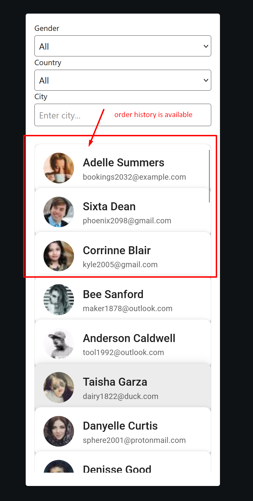
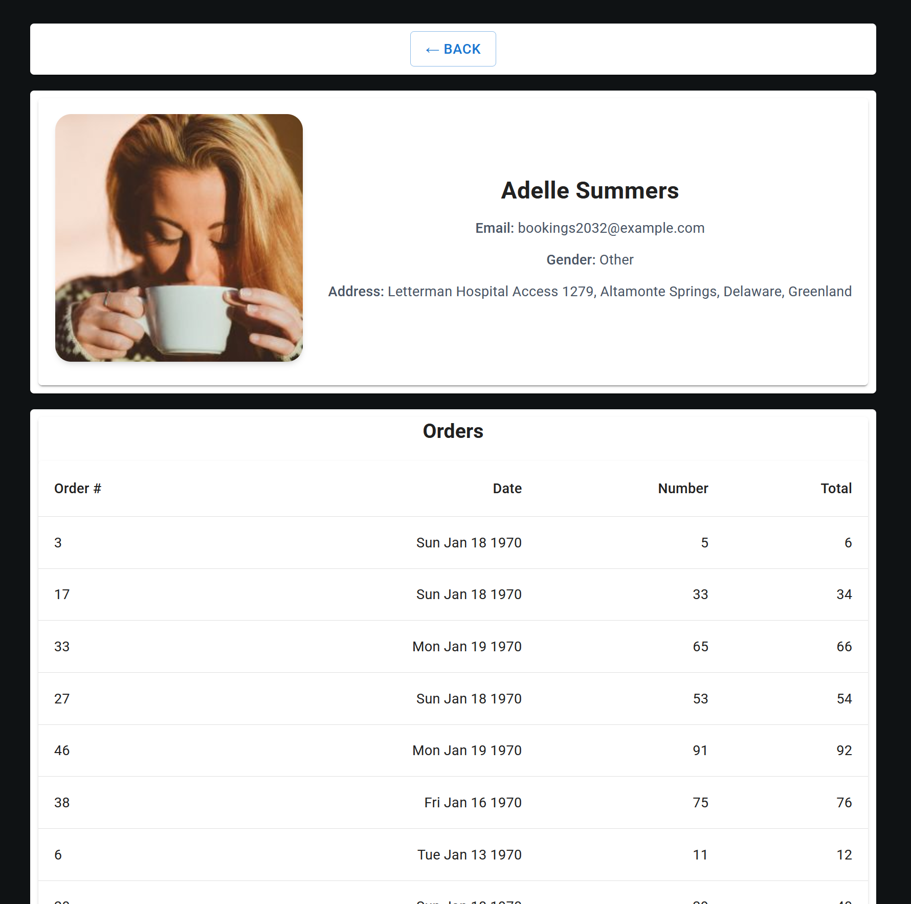

# Test Task - CRM Dashboard

## Stack
- JavaScript / TypeScript
- NestJS
- Prisma ORM
- PostgreSQL
- React
- Docker
- Vite / React

---

## How to run


```bash
copy .env.example to .env

### 1. PostgreSQL
docker-compose up -d

## server 
cd server
npm install
npx prisma generate
npx prisma db push
npx prisma db seed
npm run build
npm run start

## client
cd client
npm install
npm run build
npm run start
```
## result


