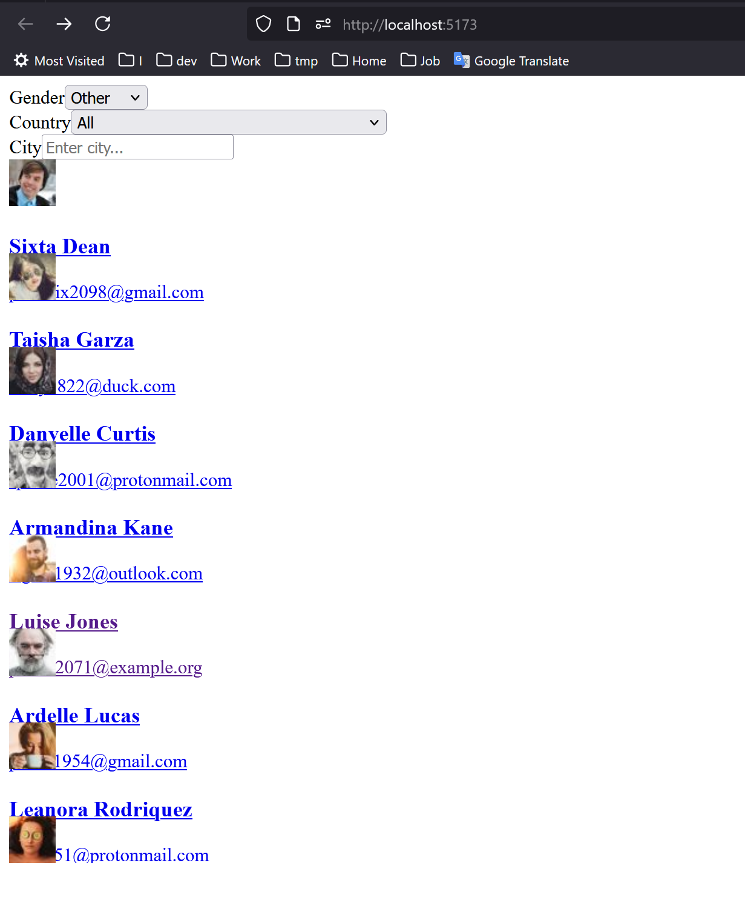
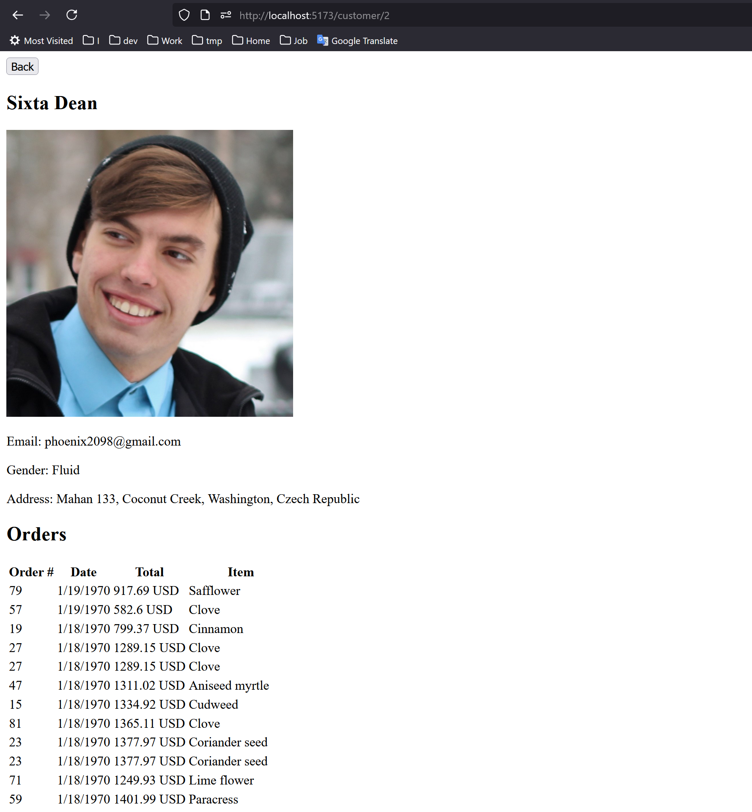

### Stack
  - Javascript
  - TypeSript
  - NestJS
  - PrismaORM
  - PostgreSQL
  - React
  - Docker
  - Vite/React

# How to run:
## server 
  cd server
  npm install
  npx prisma generate
  npx prisma db seed
  npm run build
  npm run start

## client
  cd client
  npm install
  npm run build
  npm run start

## postgres
  docker-compose up -d

## result
  
  
